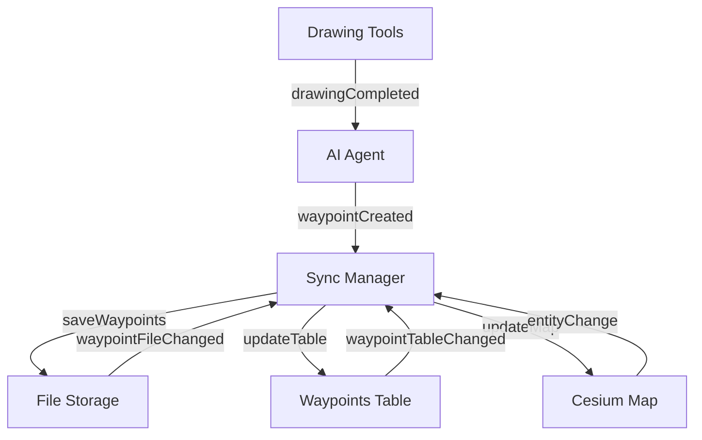

# Waypoint Synchronization System Guide

## 🎯 Overview

The Sky Loom application now features a comprehensive **Waypoint Synchronization System** that ensures real-time consistency between three key components:

1. **🗺️ Drawn Map Waypoints** - Visual shapes on the Cesium map
2. **📋 Waypoints Table** - List of waypoints in the AI Agent panel
3. **📁 JSON File Storage** - Persistent waypoint data on disk

## 🔄 How It Works

### Real-Time Event-Driven Synchronization

The system uses **Custom Events** to maintain synchronization across all components:

```javascript
// Events emitted by different components
waypointCreated    // When a new waypoint is drawn
waypointUpdated    // When a waypoint is renamed/modified
waypointDeleted    // When a waypoint is removed
waypointTableChanged // When table data changes
waypointFileChanged  // When file system changes
drawingCompleted   // When drawing tools complete a shape
```

### Automatic Periodic Sync

Every **5 seconds**, the system performs a full synchronization check:

1. **File System Sync** - Compares memory vs file data
2. **Map Entity Sync** - Restores missing waypoints to map
3. **Table Display Sync** - Updates UI components

## 🏗️ Architecture

### Core Components

#### 1. WaypointSyncManager
- **Location**: `renderer/components/rightSidebar/aiAgent/waypointSyncManager.js`
- **Purpose**: Central synchronization coordinator
- **Features**:
  - Event listeners for all waypoint changes
  - Periodic sync every 5 seconds
  - Conflict resolution and data consistency

#### 2. Enhanced AIAgent
- **Location**: `renderer/components/rightSidebar/aiAgent/aiAgent.js`
- **Enhancements**:
  - Emits events on waypoint CRUD operations
  - Integrates with WaypointSyncManager
  - Real-time table updates

#### 3. Enhanced DrawingTools
- **Location**: `renderer/components/rightSidebar/aiAgent/drawingTools.js`
- **Enhancements**:
  - Emits events when shapes are completed
  - Automatic waypoint creation
  - Map entity management

#### 4. Enhanced TrackMission
- **Location**: `renderer/components/leftSidebar/trackMission/trackMission.js`
- **Enhancements**:
  - Emits table change events
  - Real-time mission updates
  - Waypoint integration

#### 5. Enhanced WaypointStorage
- **Location**: `renderer/components/rightSidebar/aiAgent/waypointStorage.js`
- **Enhancements**:
  - Emits file change events
  - Automatic backup system
  - Fallback to localStorage

## 🚀 Usage Examples

### Creating a Waypoint

1. **Draw on Map** → DrawingTools emits `drawingCompleted`
2. **Auto-Save** → AIAgent creates waypoint and emits `waypointCreated`
3. **File Save** → WaypointStorage saves to JSON and emits `waypointFileChanged`
4. **Table Update** → Waypoints table updates automatically
5. **Map Display** → Waypoint appears on map with proper styling

### Editing a Waypoint

1. **Double-click name** → Start editing mode
2. **Save changes** → AIAgent emits `waypointUpdated`
3. **File update** → Individual JSON file updated
4. **Table refresh** → Display updates immediately
5. **Map sync** → Map entity updated if needed

### Deleting a Waypoint

1. **Click delete** → Confirmation dialog
2. **Confirm delete** → AIAgent emits `waypointDeleted`
3. **File cleanup** → JSON file removed
4. **Table update** → Row removed from table
5. **Map cleanup** → Entity removed from map

## 🔧 Technical Details

### Event Flow



### Data Consistency

The system ensures data consistency through:

1. **Event Ordering** - Events are processed in sequence
2. **Conflict Resolution** - File system takes precedence
3. **Fallback Mechanisms** - localStorage backup
4. **Error Handling** - Graceful degradation

### Performance Optimization

- **Debounced Updates** - Prevents excessive sync operations
- **Efficient Comparison** - Uses Map data structures
- **Selective Updates** - Only syncs changed components
- **Background Processing** - Non-blocking sync operations

## 🛠️ Configuration

### Sync Interval
```javascript
// In WaypointSyncManager
this.syncInterval = setInterval(() => {
    this.performFullSync();
}, 5000); // 5 seconds
```

### Event Types
```javascript
const EVENT_TYPES = {
    WAYPOINT_CREATED: 'waypointCreated',
    WAYPOINT_UPDATED: 'waypointUpdated',
    WAYPOINT_DELETED: 'waypointDeleted',
    TABLE_CHANGED: 'waypointTableChanged',
    FILE_CHANGED: 'waypointFileChanged',
    DRAWING_COMPLETED: 'drawingCompleted'
};
```

## 🔍 Debugging

### Console Logs
The system provides detailed logging:

```
✅ WaypointSyncManager initialized
📡 Emitted waypointCreated event for waypoint: landing_zone
🔄 Starting full waypoint synchronization...
📁 File system sync: Found differences, updating...
🗺️ Map sync: Restored 2 waypoints, removed 1 orphaned entities
📋 Table display updated
✅ Full synchronization completed
```

### Manual Sync
```javascript
// Force immediate synchronization
window.aiAgentInstance.syncManager.forceSync();

// Check sync status
const status = window.aiAgentInstance.syncManager.getSyncStatus();
console.log(status);
```

### Event Monitoring
```javascript
// Monitor all waypoint events
document.addEventListener('waypointCreated', (e) => {
    console.log('Waypoint created:', e.detail);
});

document.addEventListener('waypointUpdated', (e) => {
    console.log('Waypoint updated:', e.detail);
});

document.addEventListener('waypointDeleted', (e) => {
    console.log('Waypoint deleted:', e.detail);
});
```

## 🎯 Benefits

### For Users
- **Seamless Experience** - No manual sync required
- **Data Safety** - Automatic backups and consistency
- **Real-time Updates** - Changes reflect immediately
- **Cross-component Integration** - All parts stay in sync

### For Developers
- **Event-Driven Architecture** - Easy to extend
- **Modular Design** - Components are loosely coupled
- **Error Resilience** - Graceful handling of failures
- **Performance Optimized** - Efficient sync operations

## 🔮 Future Enhancements

### Planned Features
1. **Conflict Resolution UI** - Visual indicators for sync conflicts
2. **Sync History** - Track all synchronization events
3. **Selective Sync** - Sync only specific waypoints
4. **Cloud Sync** - Remote waypoint storage
5. **Offline Mode** - Work without internet connection

### API Extensions
```javascript
// Future API for external integrations
window.waypointSyncAPI = {
    forceSync: () => syncManager.forceSync(),
    getStatus: () => syncManager.getSyncStatus(),
    subscribe: (event, callback) => document.addEventListener(event, callback),
    unsubscribe: (event, callback) => document.removeEventListener(event, callback)
};
```

## 📚 Related Documentation

- [Drawing Tools Guide](DRAWING_TOOLS_GUIDE.md)
- [Waypoints Integration Guide](WAYPOINTS_INTEGRATION_GUIDE.md)
- [Troubleshooting Guide](TROUBLESHOOTING_GUIDE.md)
- [API Documentation](WAYPOINT_API_GUIDE.md)

---

**Note**: This synchronization system ensures that any change made in one component (map, table, or file) is automatically reflected in all other components, providing a seamless and consistent user experience. 